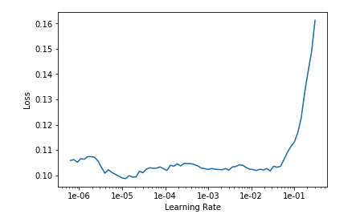

# Lesson 3 Data blocks; Multi-label classification; Segmentation

Must know: `Dataset` class in PyTorch

```py
class Dataset(object):
    """An abstract class representing a dataset
    All other datasets should subclass it and override these methods
    """
    def __getitem__(self, index):
        """Allow [] indexing"""
        raise NotImplementedError

    def __len__(self):
        raise NotImplementedError
```

Note: Pythonistas call special magic methods `__xxx__()`: "dunder" xxx.

PyTorch has another class called the `DataLoader` for making minibatches. Then, fastai's `DataBunch` uses `DataLoader`s to create a training DataLoader and a validation DataLoader. fastai has the [data block API](https://docs.fast.ai/data_block.html) to customize the creation of `DataBunch` by isolating the underlying parts of that process in separate blocks, mainly:

1. Where are the inputs and how to create them?
2. How to split the data into a training and validation sets?
3. How to label the inputs?
4. What transforms to apply?
5. How to add a test set?
6. How to wrap in dataloaders and create the DataBunch?

Check the fastai docs for function signatures and types.

To find the corresponding notebooks for the docs, go to the fastai repo

https://github.com/fastai/fastai/tree/master/docs_src/...

For multi-label image classification such as this one, to put this in a `DataBunch` while using the [data block API](https://docs.fast.ai/data_block.html), we need to use `ImageList` (and not `ImageDataBunch`). This will make sure the model created has the proper loss function to deal with the multiple classes.

```py
# This does image data augmentation by flipping them horizontally by default.
# Here we enable vertical flipping as well so it rotates every 90 degrees left and right, so 8 possible settings.
# warp: fastai has fast perspective warping. For satellite image we don't need warping
tfms = get_transforms(flip_vert=True, max_lighting=0.1, max_zoom=1.05, max_warp=0.)
```

We often want to call the same function but with different values of a parameter. For example,

```py
# We want to call with different thresh
def acc_02(inp, targ):
    return accuracy_thresh(inp, targ, thresh=0.2)

# Equivalent: a CS concept called "partial" or partial function application,
# pass in the original function and the param, returns a new wrapper function (py3)
acc_02 = partial(accuracy_thresh, thresh=0.2)
```

This is really common thing to do!

```
Question: How to use online feedback to retrain model?

Answer: Add the labeled new data into the training set, load the old model, unfreeze,
use a slightly larger learning rate and more epochs, train (fine-tune) the model some more.
```

Before `unfreeze`, we train the model's last layer. The learning rate should look like this.


Note that do not set the learning rate at the bottom, set it at the steepest place.

After `unfreeze`, we finetune the full model. The learning rate should look like this.


For this shape, we find where it starts to go up, and set it to be 10x smaller than that point as the left of the lr range, and the old learning rate for the frozen model divided by 5 or 10. Will talk about this (called discriminative learning rate) in the future.

In the notebook example for the planet data challenge, Jeremy first trained a model on size 128 by 128 image. **This is for faster experimentation and can be used as a pretrained model for the actual 256 by 256 image next.**

The process is to create the DataBunch with new size

```py
learn.load('stage-2-rn50')
# Note, set bs=32 and restart kernel after loading the saved model, or GPU can run out of memory
data = (src.transform(tfms, size=256)
        .databunch(bs=32).normalize(imagenet_stats))

learn.data = data
data.train_ds[0][0].shape
# Output: torch.Size([3, 256, 256])

# Freeze means we go back to train the last few layers for transfer learning
learn.freeze()

learn.lr_find()
learn.recorder.plot()
# Check the image below for output
lr=1e-2/2
learn.fit_one_cycle(5, slice(lr))
learn.save('stage-1-256-rn50')

learn.unfreeze()
learn.fit_one_cycle(5, slice(1e-5, lr/5))
learn.recorder.plot_losses()

# Note: save() is used for stages. Data used is also saved
learn.save('stage-2-256-rn50')
# export() returns a pickle file for inference. It saves all
# transforms, weights but not data.
# Check https://docs.fast.ai/tutorial.inference.html
learn.export()
```



## New Task: Segmentation

Example:


In segmentation, every pixel needs to be classified.

The training data needs to have images with all pixels labeled. It's hard to create such datasets, so usually we download them.

Every time we use the datasets, we should find the citation and credit the creators appropriately.

```
Question: what to do if training loss > validation loss

Answer: This means underfitting. Try
1. Train more epochs
2. Smaller learning rate
3. Decrease regularization: weight decay, dropout, data augmentation
```

The model for segmentation used is [U-Net](https://towardsdatascience.com/understanding-semantic-segmentation-with-unet-6be4f42d4b47)


Note: what does fit_one_cycle() do?

You pass in the max learning rate, and it uses a range of learning rates as the picture shows below, it goes up first and down after. The downward part is called annealing which is well known, but the upward part is quite new. The motivation is to avoid the optimization being stuck in a local minimum. The loss surface is usually quite bumpy at some areas and flat in other areas.


The approach was proposed by Leslie Smith. Read about it more [here](https://towardsdatascience.com/finding-good-learning-rate-and-the-one-cycle-policy-7159fe1db5d6).

The fastai version of unet is better than the state-of-the-art result published which is a model called hundred-layer-tiramisu!

*Trick: if GPU memory runs out very frequently, use half-precision (16-bit) rather than single-precision (32-bit) float in training. Just add `.to_fp16()` to any learner.*

```py
learn = unet_learner(
    data, models.resnet34, metrics=metrics).to_fp16()
```

Make sure the GPU driver is update-to-date to use this feature.

## Head Pose Estimation: A Regression Task

This is a regression task and the output is a set of (x, y) coordinates. We train a CNN. Instead of using a cross-entropy loss, use MSE.

## Preview next lesson: IMDB Review Sentiment, an NLP Task

For texts, we create `TextDataBunch` from csv. Texts need to be tokenized and numericalized.

When we do text classifications, we actually create 2 models: one is a language model (pretrain, for transfer learning later), the other is a classification model.

The SOTA accuracy for this dataset is ~95% and this notebook achieves that level.

Note: in deep learning, we don't care about n-grams, that's for old time NLP's feature engineering.

## Extra: Jeremy mentioned activations and pointed to one great resource

A Visual Proof that NN can approximate any shape, or, [universal approximation theorem](https://en.wikipedia.org/wiki/Universal_approximation_theorem):

- http://neuralnetworksanddeeplearning.com/chap4.html

(This is an online book, need to check it out!)

```
What really is deep learning from a math perspective:

It's a series of matrix multiplications with max(x, 0) (ReLU) in between,
and we use gradient descent to adjust the weights in these matrices to reduce the final error.

The forward pass is something like

E = loss_func(W3.dot( max(W2.dot( max( W1.dot(X), 0)), 0), 0))

The only thing is the matrices are large. That's it.
```

Usually, the hardest part is to create the DataBunch, the rest is straightforward in fastai.
