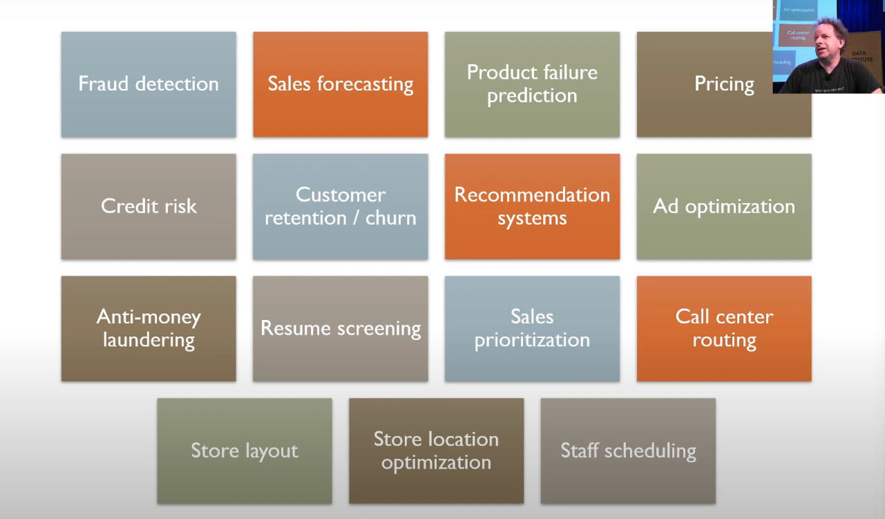

# Lesson 4: NLP; Tabular Data; Collaborative Filtering; Embeddings

2018 was the year that transfer learning started working well with NLP. You train a language model on a very large dataset to "learn to speak English", and then do transfer learning for other purposes such as text classification, NER, etc.

```
Language model on all of Wikipedia (Wikitext 103, ~1B tokens)
    ==>
    Fine-tune this language model using your target corpus
    (in this case, IMDb movie reviews)
        ==>
        Extract the encoder from this fine tuned language model, and pair it
        with a classifier. Then fine-tune this model for the final
        classification task (in this case, sentiment analysis)
```

We would think that an LM trained on Wikipedia wouldn't work well for slangs and informal language, but actually when it gets finetuned with your target corpus, it works.

For the imdb notebook, the sample data has columns `label, text, is_valid (in validation set)`.

For tokenization, most often a token is a word, sometimes it can be `'s` or a punctuation or symbol.

The full unique set of tokens is `vocabulary`. Here a limit of 60K tokens and a frequency threshold of 2 are applied to the vocab.

`xxunk` means unknown token, it means that word was not common enough to be in the vocab.

```py
# Using the data block API is the better way to create the DataBunch
data = (TextList.from_csv(path, 'texts.csv', cols='text')
                # how to split out validation set based on bool column
                .split_from_df(col=2)
                # which column is the label
                .label_from_df(cols=0)
                .databunch())
```

The reviews are in a training and test set following an imagenet structure. The only difference is that there is an `unsup` folder on top of `train` and `test` that contains the unlabelled data.

Training an LM on Wiki data takes 2-3 days on a decent GPU, no need to do that, just download the pretrained model.

Even if we have a large target corpus, we still prefer to start from the pretrained model on [wikitext-103](https://einstein.ai/research/blog/the-wikitext-long-term-dependency-language-modeling-dataset), there is no reason to start from random.

We are going to use that 'knowledge' of the English language to build our classifier, but first, like for computer vision, we need to fine-tune the pretrained model to our particular dataset. Because the English of the reviews left by people on IMDB isn't the same as the English of wikipedia, we'll need to adjust the parameters of our model by a little bit. Plus there might be some words that would be extremely common in the reviews dataset but would be barely present in wikipedia, and therefore might not be part of the vocabulary the model was trained on.

This is where the unlabelled data is going to be useful to us, as we can use it to fine-tune our model. Let's create our data object with the data block API (next line takes a few minutes).

*Trick: make sure to train the LM on **all of the data** including the test set, because it doesn't matter, there is no label for LM.*

```py
           #Inputs: all the text files in path
data_lm = (TextList.from_folder(path)
           #We may have other temp folders that contain text files so we only keep what's in train and test
            .filter_by_folder(include=['train', 'test', 'unsup'])
           #We randomly split and keep 10% (10,000 reviews) for validation
            .split_by_rand_pct(0.1)
           #We want to do a language model so we label accordingly
            .label_for_lm()
            .databunch(bs=bs))
data_lm.save('data_lm.pkl')

data_lm = load_data(path, 'data_lm.pkl', bs=bs)
data_lm.show_batch()

# This is an RNN
learn = language_model_learner(data_lm, AWD_LSTM, drop_mult=0.3)
#Downloading https://s3.amazonaws.com/fast-ai-modelzoo/wt103-fwd
```

It takes very long to even train one epoch on an average GPU. Mine took ~20min for 1 epoch before `unfreeze`. It can easily take overnight to train a good model.

For LM on Wikipedia, ~30% accuracy is quite good. For more specific documents like medical or legal, it can be higher.

After training the LM on the target corpus, we save the encoder

```py
learn.save_encoder('fine_tuned_enc')
```

Next, we can build the classifier.

```py
            #grab all the text files in path, MUST use the same vocab and order
data_clas = (TextList.from_folder(path, vocab=data_lm.vocab)
             #split by train and valid folder (that only keeps 'train' and 'test' so no need to filter)
             .split_by_folder(valid='test')
             #label them all with their folders
             .label_from_folder(classes=['neg', 'pos'])
             .databunch(bs=bs))

data_clas.save('data_clas.pkl')

learn = text_classifier_learner(data_clas, AWD_LSTM, drop_mult=0.5)
learn.load_encoder('fine_tuned_enc')

learn.lr_find()
learn.recorder.plot()

# moms is the momentum for the optimizer
learn.fit_one_cycle(1, 2e-2, moms=(0.8,0.7))

learn.save('first')
learn.load('first')

# NOTE: This only unfreezes the last 2 layers
learn.freeze_to(-2)
# NOTE: The 2.6**4 stuff is called discriminative learning rate
# the range controls the lr for different layers since they learn best at different rate
learn.fit_one_cycle(1, slice(1e-2/(2.6**4),1e-2), moms=(0.8,0.7))

learn.save('second')
learn.load('second')

# Unfreeze last 3 layers
learn.freeze_to(-3)
learn.fit_one_cycle(1, slice(5e-3/(2.6**4),5e-3), moms=(0.8,0.7))

learn.save('third')
learn.load('third')

# Unfreeze whole model to finetune
learn.unfreeze()
learn.fit_one_cycle(2, slice(1e-3/(2.6**4),1e-3), moms=(0.8,0.7))

learn.predict("I really loved that movie, it was awesome!")
```

NOTE: When creating the classifier learner, we MUST have the same `vocab` as the pretrained language model. The line

```py
data_clas = (TextList.from_folder(path, vocab=data_lm.vocab)
    ...
```

is very important. Have the right `data_lm` in memory and create `data_clas` with its `vocab`, or there will be an error when loading the pretrained model via `learn.load_encoder('fine_tuned_enc')` and it will say

```
Error(s) in loading state_dict for AWD_LSTM: size mismatch...
```

*Trick: for text classification, **unfreezing one layer at a time and train some more** is an effective strategy.*

*Trick: Jeremy created a random forest to find best hyperparameter setting. The best number for discriminative learning rate is 2.6^4. This is similar to AutoML for hyperparam search.*

For training Chinese language models, search the forum for more info.

## Tabular Data using Deep Learning



People were skeptical about using neural nets on tabular data, they often use logistic regression, random forest, gradient boosting machines to do it. In fact, NN is extremely useful for tabular data.

With NN, you don't need to hand engineer features as much as before. It's more accurate and requires less maintenance. Jemery used to use Random Forest 99% of the time for tabular data, now he uses NN 90% of the time.

Nobody else created a library for NN on tabular data, fastai has `fastai.tabular`. In the notebook `lesson4-tabular` there is a detailed example.

It assumes the data is in a pandas dataframe. Pandas can read from csv, relational db, Spark and Hadoop.

The independent variables (features) can be continuous or categorical. With NN, we use **embeddings** for categorical variables.

Instead of having "transform"s as in CV such as brightening, flipping, normalization etc., we have "processor"s for tabular data. The difference is that transforms are for data augmentation and are different each time, but processors are run once ahead of time.

```py
dep_var = 'salary'
cat_names = ['workclass', 'education', 'marital-status', 'occupation', 'relationship', 'race']
cont_names = ['age', 'fnlwgt', 'education-num']

# 1. Deal with missing values in some way
# 2. Use pandas categorical variables
# 3. Normalize continuous variables by mean 0 and std 1
procs = [FillMissing, Categorify, Normalize]

data = (TabularList.from_df(df, path=path, cat_names=cat_names, cont_names=cont_names, procs=procs)
                            # when split validation set, must have contiguous indices
                            # think time periods, video frames, or other structure in data
                           .split_by_idx(list(range(800, 1000)))
                           .label_from_df(cols=dep_var)
                           .add_test(test)
                           .databunch())

data.show_batch(rows=10)
learn = tabular_learner(data, layers=[200, 100], metrics=accuracy)
learn.fit(1, 1e-2)

# Inference
row = df.iloc[0]
learn.predict(row)
```

For time series tabular data, you generally don't use RNN for them. Instead, you can time box them into day_of_week, time_of_day, etc. and it will give you state of the art result.

## Collaborative Filtering

When you have data about who-bought-what, who-liked-what, you can have two columns like [userId, productId] in the most basic form. Other metadata can be added, like timestamp, review, etc.

This matrix is very sparse because most users didn't buy most products / watched most movies.

In this example our data has `userId, movieId, rating, timestamp`.

```py
ratings = pd.read_csv(path/'ratings.csv')

data = CollabDataBunch.from_df(ratings, seed=42)
y_range = [0,5.5]

learn = collab_learner(data, n_factors=50, y_range=y_range)
```

**For recommender systems, a big challenge is the Cold Start problem**. It means that we particularly care about recommending **new movies** or recommend relevant movies to **new users** which we don't have any data for. The solution is to have a second model on user or movie metadata to quatify the similarities.

Netflix fixed the cold start problem by UX. It asks a new user whether they like the movies they show as a survey. For new movies, they just need to let some hundreds of people watch it and rate them. It wasn't quite a cold start problem for Netflix.

But for selling products, you might not want people to look at your range of products. You could for example find the metadata of the users such as what geography they are from, their age, gender, and other features to predict whether they would like something.

Collaborative filtering is specifically for when you already have some data about the preferences of the users.

A user has an embedding vector. A movie has an embedding vector. A bias term needs to be added in the user embedding and can be interpretted as *the user's tendency to like movies in general regardless of what movie*. Similarly, a bias term in the movie embedding is like *the likeability of a movie regardless of users*.

The target value is the rating in the range 0 to 5. We dot the user embedding and the movie (item) embedding along with the weights, and *pass it through a sigmoid* (and times 5) to get a numbder between 0 - 5. Notice that this is actually a "logistic regression" (linear layer on inputs and a sigmoid) but with MSE loss and target variables as numbers between 0 - 5.

Note that this mapping from the product of embeddings to the range [0, 5] is still regression and not classification, so the loss used is MSE and not cross entropy.

Why pass through the sigmoid? It makes the model learn easier and let the weights converge to relevant results. It is very common to use sigmoid or softmax as the last layer to produce the output.

Question: it seems this is a sigmoid(linear model) with MSE, the optimization is nonconvex. How is it done?
