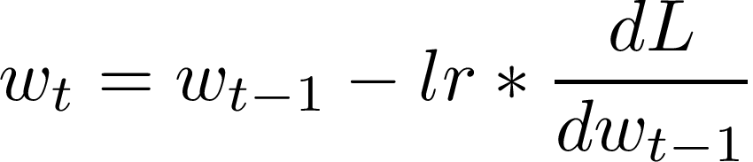
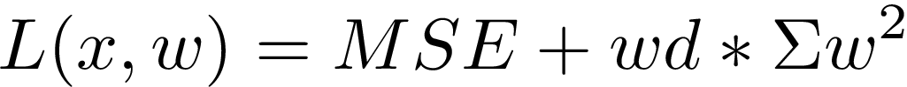
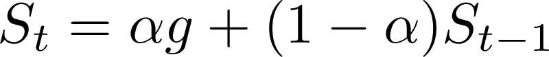
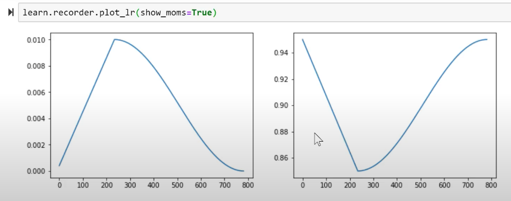

# Lesson 5: Collaborative Filtering cont.; Backpropagation; Accelerated SGD; NN from Scratch

PyTorch tip: anything with an underscore after, means in-place, for example `a.sub_(val)` means `a -= val`.

SGD:

- in code: `a.sub_(lr * a.grad)`
- in formula

---


---
There two types of tensors in NN

- parameters
- activations

Input data is one special case in activation.

Activation functions are element-wise functions. Most of the time just use ReLU.

**Universal Approximation Theorem: once you stack these tensors together, you can get arbitrarily close approximation of any function.**


## Finetuning: what happens when we do transfer learning on resnet-34?

`resnet-34` is trained on imagenet where the task was to output probabilities for 1000 classes, so the last layer of weights has 1000 columns.

You probably don't have 1000 classes, or don't have the same 1000 classes. So that last layer is of no use to you.

---
When you do `create_cnn` in fastai, it deletes the last layer and puts in two new weight matrices and a ReLU in between, the one to the right has `# columns = databunch.c`. All previous layers are frozen.
---

It's faster, needs less memory when we freeze early layers.

---
After `unfreeze`, we split our model into a few sections. We think the earlier layers are pretty good, so we give them a smaller learning rate. For example, the first section we give it `lr = 1e-5` and the second section we give it `lr = 1e-3`, etc. This is called **Discriminative Learning Rate**.
---

We don't want to mess with already good layers with big learning rate.

When you call `fit`,

```py
# All layers use the same learning rate
fit(num_epoch, lr=1e-3)
# The last layers (added by create_cnn) use 1e-3, and ALL OTHER LAYERS USE THIS VALUE / 3.
# Will discuss the /3 in part II. It's a quirk of batch normalization
fit(num_epoch, lr=slice(1e-3))
# The last layers added by create_cnn will use 1e-3, the first layers will use 1e-5,
# the middle layers will have equally spaced lr between the two
fit(num_epoch, lr=slice(1e-5, 1e-3))
```

We use different lr for different *layer groups*.

For Collaborative Filtering, there is only one layer, so use just one lr is fine.

---
Terminology: Matrix multiplication is one form of **Affine Functions**. Convolution is another form. When we talk about affine functions we mean linear function like matrix multiplication.

---

## Collaborative Filtering cont.

Tip: Multiplying with a one-hot encoded matrix (identity matrix) is equivalent to a row lookup. Therefore, never actually do the matrix multiplication, do row lookup instead for better time and space performance.

Terminology: **embedding** means look something up in an array, which is equivalent to multiplying with an identity matrix, or one-hot encoded matrix.

Once we train a collaborative filtering model, the result user embeddings and movie embeddings contain interesting property of users and movies.

For example, the 1st number in the user embedding could mean whether that user likes a movie with Tom Hanks in it, and the 1st number in the movie embedding is an indicator whether the movie has Tom Hanks. Then, the dot product has a bigger value if both numbers are big, meaning the user will like that movie.

Each dimension in the embedding is a kind of **latent factor**.

Bias term: there are genuine bad movies, and there are users who generally rate movies low or high. That is when the **bias term** is useful. It is the value that's not relevant to all the latent factors in the embedding.

```
learn = collab_learner(data, n_factors=40, y_range=y_range, wd=1e-1)
```

Trick: to get more accuracy on the movie ratings data ranging from 0.5 to 5, set the y_range (which controls the sigmoid asymptotes) to [0, 5.5]

`n_factors` for `collab_learner` is the # columns, or the # embedding dimensions. They are the "latent factors". This learner is actually doing matrix factorization. `n_factors = 40` is an experiment result that works best.

One good trick to identify best and worst movies regardless of latent factors (they are good or bad on average and not affected by user attributes) is to look at bias. For example, these are some generally bad movies,

```
[(tensor(-0.3807),
  'Children of the Corn: The Gathering (1996)',
  1.3157894736842106),
 (tensor(-0.2987), 'Mortal Kombat: Annihilation (1997)', 1.9534883720930232),
 (tensor(-0.2976), 'Striptease (1996)', 2.2388059701492535),
 (tensor(-0.2973),
  'Lawnmower Man 2: Beyond Cyberspace (1996)',
  1.7142857142857142),
 (tensor(-0.2699), 'Cable Guy, The (1996)', 2.339622641509434),
 (tensor(-0.2676), 'Free Willy 3: The Rescue (1997)', 1.7407407407407407),
 (tensor(-0.2578), 'Grease 2 (1982)', 2.0),
 (tensor(-0.2526), 'Barb Wire (1996)', 1.9333333333333333),
 (tensor(-0.2502), 'Bio-Dome (1996)', 1.903225806451613),
 (tensor(-0.2438), 'Island of Dr. Moreau, The (1996)', 2.1578947368421053),
 (tensor(-0.2407), 'Crow: City of Angels, The (1996)', 1.9487179487179487),
 (tensor(-0.2275), "Joe's Apartment (1996)", 2.2444444444444445),
 (tensor(-0.2187), 'Leave It to Beaver (1997)', 1.8409090909090908),
 (tensor(-0.2173), 'Lawnmower Man, The (1992)', 2.4461538461538463),
 (tensor(-0.2076), "Stephen King's The Langoliers (1995)", 2.413793103448276)]
```

And these are some generally good movies,

```
(tensor(0.5738), "Schindler's List (1993)", 4.466442953020135),
 (tensor(0.5580), 'Titanic (1997)', 4.2457142857142856),
 (tensor(0.5491), 'Silence of the Lambs, The (1991)', 4.28974358974359),
 (tensor(0.5480), 'Shawshank Redemption, The (1994)', 4.445229681978798),
 (tensor(0.5439), 'Star Wars (1977)', 4.3584905660377355),
 (tensor(0.5278), 'L.A. Confidential (1997)', 4.161616161616162),
 (tensor(0.5112), 'As Good As It Gets (1997)', 4.196428571428571),
 (tensor(0.5078), 'Rear Window (1954)', 4.3875598086124405),
 (tensor(0.4927), 'Good Will Hunting (1997)', 4.262626262626263),
 (tensor(0.4855), 'Apt Pupil (1998)', 4.1),
 (tensor(0.4810), 'Casablanca (1942)', 4.45679012345679),
 (tensor(0.4728), 'Usual Suspects, The (1995)', 4.385767790262173),
 (tensor(0.4705), 'Close Shave, A (1995)', 4.491071428571429),
 (tensor(0.4539), 'Boot, Das (1981)', 4.203980099502488),
 (tensor(0.4514), 'Vertigo (1958)', 4.251396648044692)
```

It's likely that recommending the ones with biggest positive biases is good for new users we don't know much about.

To understand the latent factors, 40 is too much to look at. We can do PCA and reduce to 3 dimensions.

Note: checking activation layers in NN with PCA is often a good idea, because we have way too many activations to have intuition.

Trick: for image similarity, if we run similarity functions over the image activations directly it can be too large. A better idea is to run PCA on image activations and then use the reduced dimensions to run similarity!

## Weight Decay `wd` in `learner`

Weight decay is a way of **regularization**, it controls the model complexity. **It is the coefficient of the sum of squares of parameters**, effectively reduce the complexity by making unnecessary parameters smaller. The value of weight decay `wd` is usually `1e-1` (0.1). This is the result of a lot of experiments on different dataset.

---


---
Weight decay `wd` is a parameter for **all** `learner`s in `fastai`, even if you don't see it in the signature of a particular learner, it is there because it's in the parent `learner` class. The default value is 0.01 and not 0.1 because in rare cases, too big a `wd` caps the model performance, but too small a `wd` just makes the model easy to overfit and doesn't cap the performance, the solution is to stop early.

### Reason for having weight decay

We don't want too much complexity, but we DO want many parameters to capture the potential curvy bits of reality. The answer is to have many parameters but penalize their values.

Note, complexity != # parameters. Because some parameters can be very small and close to 0, even though we have many of them, they are barely there which means not much complexity.

## Entity Embeddings of Categorical Variables

[Paper](https://arxiv.org/pdf/1604.06737.pdf). Used NN and entity embedding layers for tabular data and got great results.

MAPE: mean average percentage error.

## SGD with MNIST

Subclassing is very very common in pytorch. Override the constructor.

```py
class Mnist_Logistic(nn.Module):
    def __init__(self):
        super().__init__()
        self.lin = nn.Linear(784, 10, bias=True)

    # xb means a minibatch of x
    def forward(self, xb): return self.lin(xb)
```

Then create the logistic regression model,

```py
# Create the model and put it on GPU
model = Mnist_Logistic().cuda()
model
# Mnist_Logistic(
#   (lin): Linear(in_features=784, out_features=10, bias=True)
# )
model.lin
# Linear(in_features=784, out_features=10, bias=True)
model(x).shape
# torch.Size([64, 10])
[p.shape for p in model.parameters()]
# [torch.Size([10, 784]), torch.Size([10])]
# means it takes 784 dim input and output 10 dim, then there's the 10d bias
```

The SGD update with weight decay,

```py
lr=2e-2
loss_func = nn.CrossEntropyLoss()

def update(x,y,lr):
    wd = 1e-5
    y_hat = model(x)
    # weight decay
    w2 = 0.
    for p in model.parameters(): w2 += (p**2).sum()
    # add to regular loss
    # THIS IS L2 REGULARIZATION!
    loss = loss_func(y_hat, y) + w2*wd
    loss.backward()
    with torch.no_grad():
        for p in model.parameters():
            p.sub_(lr * p.grad)
            p.grad.zero_()
    # Tensor.item() -> a normal python number
    return loss.item()

losses = [update(x,y,lr) for x,y in data.train_dl]
```

In this case, weight decay is equivalent to L2 regularization because the gradient of the regularization term `wd * w^2` gives `2 wd * w`.

*(Later there's a case where weight decay != L2 regularization!!)*

Weight decay helps prevent overfitting, so
- we can have a giant model without overfitting
- or we can have a smaller dataset

Too much weight decay can also hurt training.

The above is a logistic regression by pytorch from scratch. Here we make an NN with pytorch from scratch.

```py
class Mnist_NN(nn.Module):
    def __init__(self):
        super().__init__()
        self.lin1 = nn.Linear(784, 50, bias=True)
        self.lin2 = nn.Linear(50, 10, bias=True)

    def forward(self, xb):
        x = self.lin1(xb)
        x = F.relu(x)
        return self.lin2(x)

model = Mnist_NN().cuda()

def update(x,y,lr):
    # Instead of SGD we can use `optim.Adam`
    opt = optim.Adam(model.parameters(), lr)
    y_hat = model(x)
    loss = loss_func(y_hat, y)
    loss.backward()
    opt.step()
    opt.zero_grad()
    return loss.item()

losses = [update(x,y,1e-3) for x,y in data.train_dl]
```

### Optimizer: SGD with Momentum

Apply exponentially weighted moving average on the last several derivatives (steps). The more recent steps are exponentially higher weighted.

---


---
Alpha is the momentum, S are the steps, g is the gradient.

To use it in pytorch, just use `optim.SGD` with a `momentum` param. Set it to 0.9.

### Optimizer: RMSprop

Geoff Hinton first mentioned RMSprop in his Coursera NN course! That is the correct way to cite it.

It's very similar to SGD with momentum. It uses squared gradient in the denominator. If it's small the step will be big.

If the gradient is consistently small, it will be a small number. If gradient is volatile or consistently big, it will be a big number. This is because **if the gradient is always small we need to take bigger steps**.

### Optimizer: Adam

Adam is Momentum + RMSprop. It keeps track of the exponentially weighted moving average and the squared gradient.

We still need to set the learning rate, and do learning rate annealing!

### In fastai, use `learner`, and it sets the optimizer (Adam or a slight variation of Adam by default) and you don't need to worry.

`fit_one_cycle` helps you get "super convergence", i.e. train 10x faster than plain SGD. It has smaller lr and large momentum in the beginning, and then lr increases, momentum decreases. When it's close to optimum, lr decreases again and momentum increases.



This is research result by Leslie Smith.

### Cross-Entropy Loss

If we have a classifier for Cats and Dogs

|Cat|Dog|Pred(Cat)|Pred(Dog)|X-entropy|      Comment|
|---|---|---------|---------|---------|-------------|
|  1|  0|      0.5|      0.5|      0.3|unsure|
|  1|  0|     0.98|     0.02|     0.01|confident, right|
|  0|  1|      0.9|      0.1|        1|confident, wrong|
|  0|  1|      0.5|      0.5|      0.3|unsure|
|  1|  0|      0.9|      0.1|     0.05|confident, right|

The unsure cases have moderate loss, confident and right has the lowest loss, confident but wrong has the highest loss.

The cross-entropy formula is

`-y log(y_hat) - (1-y) log(1-y_hat)`

Keep in mind that now Cat is 1. This basically means,

If Cat (y=1), then look at log of `Pred(Cat)`;

If Dog (y=0), then look at log of `1-Pred(Cat)`, i.e. Pred(Dog);

MUST make sure the preds to plug into cross-entropy add to one. To make sure of that, use the **softmax** activation.

For multi-class classification, use **cross-entropy** as loss and **softmax** as activation.

Note: in PyTorch, calling `nn.CrossEntropyLoss()` actually calculates the softmax behind the scene so there is no need to add a softmax layer manually.

If you use a custom loss and want softmax output, make sure to add the softmax layer at the end.

### Regularization: weight decay, batch norm, dropout

