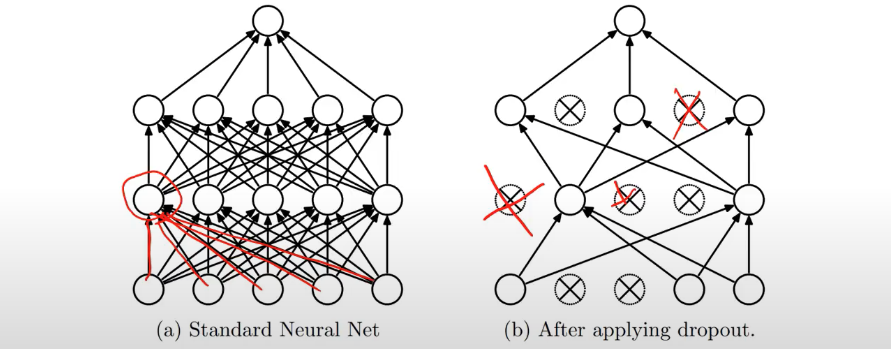
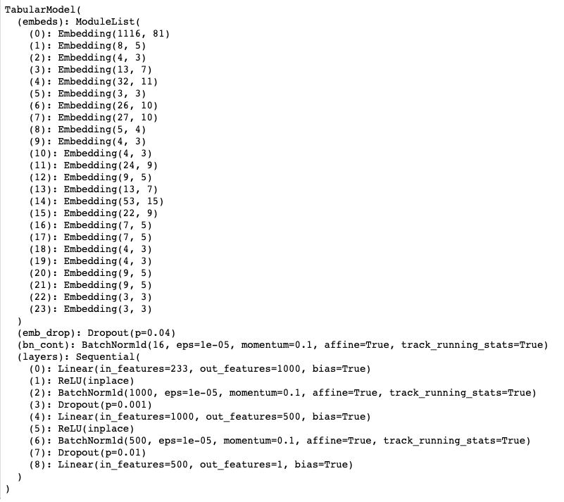
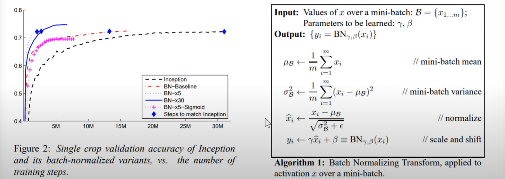
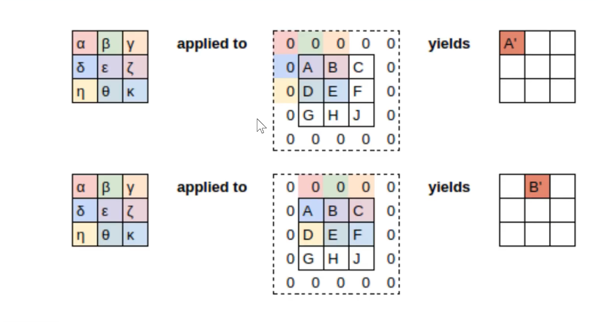
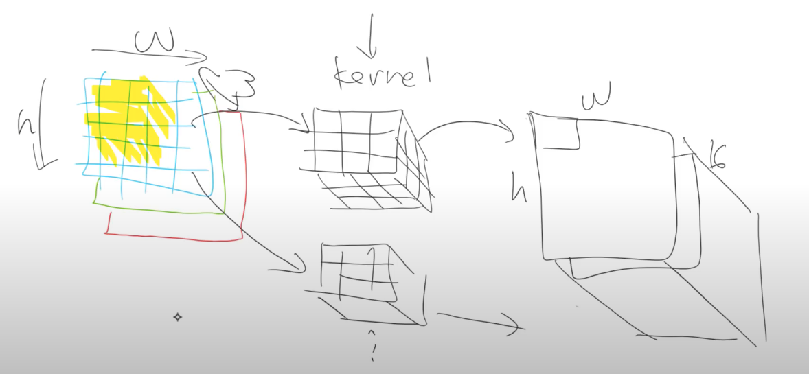
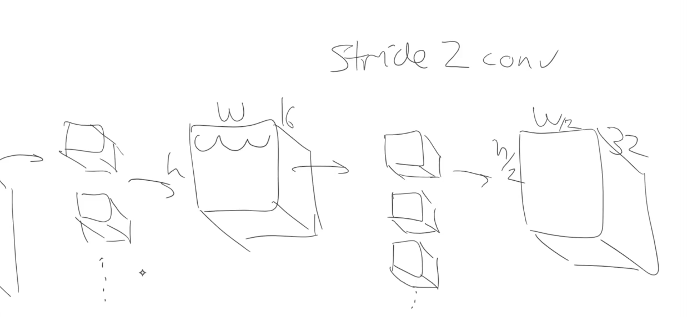
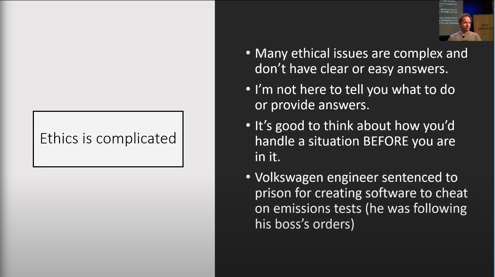

# Lesson 6: Regression on Tabular Time Series; Regularization; Convolution; Data Ethics

Tip: Use platform.ai to find clusters of unlabeled data to label manually. It uses pretrained models so you can pick a middle layer and pick some specific projections from it. It's a way of clustering similar images for labeling and it helps you build your better model on top of it. There is a [thread](https://forums.fast.ai/t/platform-ai-discussion/31445) for more info.

## Regression on Tabular Time Series; Regularization cont.

Look at the rossmann dataset from Kaggle. It uses historical sales data to predict a small period in its future.

**Most of times, the approach of embeddings and tabular data is more effective than RNNs for time series forecasting because we have useful metadata like day of week, day of month, locations, etc. RNN is better for pure sequences. So, in most business settings, use tabular approach for time series!**

Tip: grab a small part of data, say 2000 rows to explore first. Split to training and test.

The two notebooks for rossmann data are great examples of `pandas` data preprocessing. There are preprocessors `Categortify` (-1 for NaN), `Fillmissing` (replace NaN with median), etc. You can apply them by simply assigning them to a list and pass into databunch creation.

Next, identify categorical and continuous variables. Think carefully. For example, `Day` may be a number but it's categorical because in some cases the number of sales for a day is independent of surrounding days.

Don't forget to make the validation set with **the same time range** as the test set!

```py
procs=[FillMissing, Categorify, Normalize]

cat_vars = ['Store', 'DayOfWeek', 'Year', 'Month', 'Day', 'StateHoliday', 'CompetitionMonthsOpen',
    'Promo2Weeks', 'StoreType', 'Assortment', 'PromoInterval', 'CompetitionOpenSinceYear', 'Promo2SinceYear',
    'State', 'Week', 'Events', 'Promo_fw', 'Promo_bw', 'StateHoliday_fw', 'StateHoliday_bw',
    'SchoolHoliday_fw', 'SchoolHoliday_bw']

cont_vars = ['CompetitionDistance', 'Max_TemperatureC', 'Mean_TemperatureC', 'Min_TemperatureC',
   'Max_Humidity', 'Mean_Humidity', 'Min_Humidity', 'Max_Wind_SpeedKm_h',
   'Mean_Wind_SpeedKm_h', 'CloudCover', 'trend', 'trend_DE',
   'AfterStateHoliday', 'BeforeStateHoliday', 'Promo', 'SchoolHoliday']

dep_var = 'Sales'
df = train_df[cat_vars + cont_vars + [dep_var,'Date']].copy()

data = (TabularList.from_df(df, path=path, cat_names=cat_vars, cont_names=cont_vars, procs=procs,)
        .split_by_idx(valid_idx)
        # NOTE: fastai assumes classification if label_cls is not float, here we need regression, so make it a FloatList!
        # log=True takes log of y, use this for percent error because it turns ratio into difference, RMSPE -> RMSE
        .label_from_df(cols=dep_var, label_cls=FloatList, log=True)
        .add_test(TabularList.from_df(test_df, path=path, cat_names=cat_vars, cont_names=cont_vars))
        .databunch())
```

Tip: for target variable as population, sales etc. where we care more about change rather than absolute differences, we use Root Mean Squared Percent Error (RMSPE) rather than RMSE. Take the log of y with `log=True` above to make it RMSE.

Trick: set `y_range` a bit wider than actual to get better result. In this case 1.2 * ymax.

For this problem, the architecture is a fully connected NN. This Kaggle competition is 3 years old but there is no significant better model than it.

We use a weight matrix of 1000 by 500, which is **500K parameters on a few 100K dataset. It is going to overfit**. Use regularization to counter overfitting, NOT reducing the parameters manually.

`ps=[0.001, 0.01]` is DROPOUT. The dropout [paper](https://www.cs.toronto.edu/~hinton/absps/JMLRdropout.pdf).

**Dropout is not dropping weights, but dropping activations!**



Each minibatch we throw away a difference subset of the activations with probability `p`. A common value is 0.5.

Hinton mentioned where this idea came from. He's a neural scientist by training so he used dropout to imitate the effect of spiking neurons given that we don't exact know how neurons spike.

"If you have noisy activations, you can afford to use a much bigger model" -- Hinton.

These math ideas almost never come from math but from physical intuitions.

*Jeremy advice for research: the original dropout paper is one of the most influential papers in the last decade but was rejected by NIPS. The research community is poor at recognizing important work. Find what interests you and don't just follow what most people say.*

**Dropout works really really well!**

```py
learn = tabular_learner(data, layers=[1000,500], ps=[0.001,0.01],
    emb_drop=0.04, y_range=y_range, metrics=exp_rmspe)
```

`ps` is a list of dropout probabilities. All fastai learners have this parameter.

In PyTorch, dropout is applied at training time and not test time. You don't need to do anything at test time.

`emb_drop` is to randomly drop activations in the embedding.

Reminder: what is embeddings in this case? It's the vector for each feature, e.g. `stores`, `DayOfWeek`, `Year`, etc. The data matrix started with them as columns and each entry in time as row. Do a matrix factorization and we get these embeddings for the features.



`BatchNorm1d` is for continuous variables.

Batch normalization [paper](https://arxiv.org/pdf/1502.03167.pdf). Interestingly, the attempt to explain why it helps NN training (by reducing covariate shifts) was wrong in this paper. Usually researchers have intuitions and did the experiment, it worked, and tried to find math explanations post-hoc. Another [paper](https://arxiv.org/pdf/1805.11604.pdf) found it is not why it works.



**With batch norm, the loss landscape is not as bumpy as without batch norm! You can increase your learning rate!**

Explanation: the reason it works is **activation range shift**. people used to think the normalization by mean and std is the important reason why it worked. But it's actually the two extra parameters. We use `activations * g + b` to shift the activations from one range to another, just like when we have output predictions in 0-1 but we need to shift to 1-5 for movie ratings. `g` and `b` are the biases to directionly shift the range rather than relying on the weights. The weights have nonlinear relationships because of the nonlinear activations in between so they are hard to tune for range shifting (that's why the loss landscape is bumpy). With 2 more direct controlling parameters, the range shift is much easier.

A much newer method is called Weight Norm and is used by fastai.

Note: for batch norm, we don't actually use the exact mean and std for each minibatch, that will be too bumpy. We use the exponentially weighted moving average of mean and std. That's why there is a `momentum=0.1` in batch norm layer, it is not the momentum as in optimization, it is for moving average.

---
A smaller momentum means less variations from minibatch to minibatch ==> less regularization
---
A larger momentum means more variations from minibatch to minibatch ==> more regularization
---

---

In the regularization techniques, we

- always want batch norm
- weight decay is more preferable than L2 regularization
- weight decay vs. dropout? No definitive answer. Use a bit of both. Try it out.

The next regularization technique is **data augmentation**. Jeremy is most excited about this approach.

## CNN, Data Augmentation; Regularization cont.

Now use the pets-more notebook.

```py
# check this list of transformations
doc(get_transforms)
```

Tip: for border transform, "reflection" works the best! Better than black borders. And warping works great.

Apply the kind of transform that will match test data.

Research: how to do data augmentation outside CV, e.g. in NLP.

Jeremy goes on explaining convolution and image kernel with visual explanation [here](https://setosa.io/ev/image-kernels/), developed by ex-Uber colleague Victor Powell.



Since 3-by-3 kernels can only reach the second to last rim of the image, we need padding. 0-padding is fine but **reflective padding** is better.

How CNN works:

- We have RGB color image of size `w * h * 3`, apply k `3 * 3 * 3` kernels to it (without hard definitions such as left right sobel, just randomly init them). Each kernel outputs 1 number, so we end up with a `w * h * k` output of the image.

- We can have stride 2 by 2 so the `w * h` gets shrinked by a factor of 2. We also apply 2x more kernels, so **the output gets squashed into a longer stick shape with smaller cross section.**.

- We repeatedly stack a lot of these conv layers.





One interesting trick is that we use a 7 by 7 kernel (and more padding) for the first layer to handle the input image, then use 3 by 3 ones in hidden layers. Jeremy will talk about why in Course Part II.

Tip: `learn.summary()` and `learn.model` prints out the info and architecture of the NN.

## Heatmap for CNN

Next, **find the heatmap for CNN's focus in images**.

```py
# Make the kernel for 3 channels
k = tensor([
    [0.  ,-5/3,1],
    [-5/3,-5/3,1],
    [1.  ,1   ,1],
]).expand(1,3,3,3)/6
```

In PyTorch, the shape of the tensor in the case is `(# kernels, # channels, height, width)`.

**Trick: indexing into a tensor in both pytorch and numpy gives to a new unit axis!!**

```py
t.shape = (3, 352, 352)

# Very handy trick
t[None].shape
# (1, 3, 352, 352)
```

### How the last layers work

Say we have a `(w=11, h=11, ch=512)` shape layer, that is the **last layer of the conv part of the network**. The output expects a vector of shape `(class=37, 1)`, for that we **take the mean of every slice in the 512 slices, each (w, h) slice only outputs 1 number. This is called AVERAGE POOLING**. Now, we have a `(512, 1)` vector. We then need a weight matrix of `(37, 512)`. This is a linear layer that has input size 512 and output size 37.

```

    W1
    --
    W2
    --
    W3       *       (x1 | x2 | x3 | ... | x512)_T
    --
    ...
    --
    W37

Each weight vector W has length 512, it dots the (512, 1) vector, produces a weighted sum, activation A1 for class 1. Same for other Ws. We then have an output of (A1 ... A37).

The different setting of each W, a shape (1, 512) row vector is the deciding factor that maps the 512 features from average pooling into the final 37 classes.
```

This is how the classification is done. Each averaged number from a slice indicates a "feature", it could be "how fluffy it is", "does it have pointy ears", etc. The average is equivalent to a sum of the activations in each slice indicating how activated collectively they are in one slice.

Interestingly, if you squash the 512 channels to 1 and average over all the `(w, h)` slices, the output is one `(w, h)` matrix. This is the average of all the pixels in the same position in each channel. It then indicates the relevance of "position", not individual features. With this, we can create a heatmap that shows where it is most relevant to decide whether the cat is a maine coone.

Tip: `fastai` has a great advanced feature called a "hook". It allows you to tap into the pytorch code, e.g. a forward pass and manipulate the values in the middle layers.

Tip: **if you use `hook`, don't forget to remove it after**, because it will store the intermediate values everytime you call the model and it is memory intensive.

```py
# To get the conv part of the network, do this
m = learn.model.eval()
m[0]
# Then it shows the conv part of the network

# Create a minibatch with just one image in it
xb,_ = data.one_item(x)
xb_im = Image(data.denorm(xb)[0])
# Pop it into a GPU
xb = xb.cuda()

# To hook into the output of m[0]
from fastai.callbacks.hooks import *

def hooked_backward(cat=y):
    # `with` in Python is called context manager,
    # at the end of `with` it will remove the hook
    with hook_output(m[0]) as hook_a:
        with hook_output(m[0], grad=True) as hook_g:
            # pytorch allows us to use the model as a function m()
            preds = m(xb)
            preds[0,int(cat)].backward()
    # we don't care about pred, we care about the hook
    return hook_a,hook_g

hook_a, hook_g = hooked_backward()

# fastai hook has .stored for the things you want in the hook
acts  = hook_a.stored[0].cpu()
acts.shape

def show_heatmap(hm):
    _,ax = plt.subplots()
    xb_im.show(ax)
    ax.imshow(hm, alpha=0.6, extent=(0,352,352,0),
              interpolation='bilinear', cmap='magma');

show_heatmap(avg_acts)
```

Tip: it's very important to frequently print out the shapes of the tensors, and think about why, think about the pictures in CNN architecture, the `learn.summary()` and `learn.model`.

## Data Ethics

Check out Rachel's TED talk [here](https://www.youtube.com/watch?v=LqjP7O9SxOM).



One potential solution: put human in the loop!

Don't be slaves of algorithm, avoid run-away feedback loops (bad recommendations feed bad behaviors).


