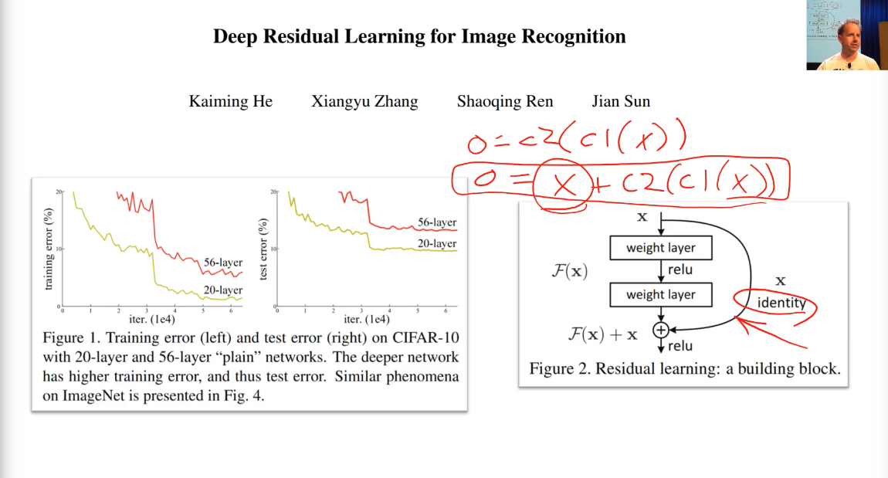
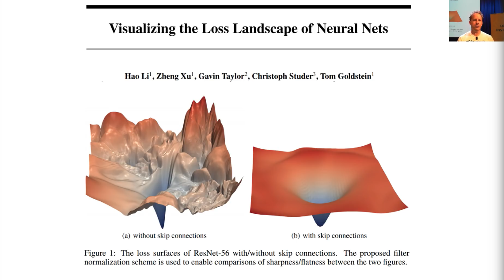
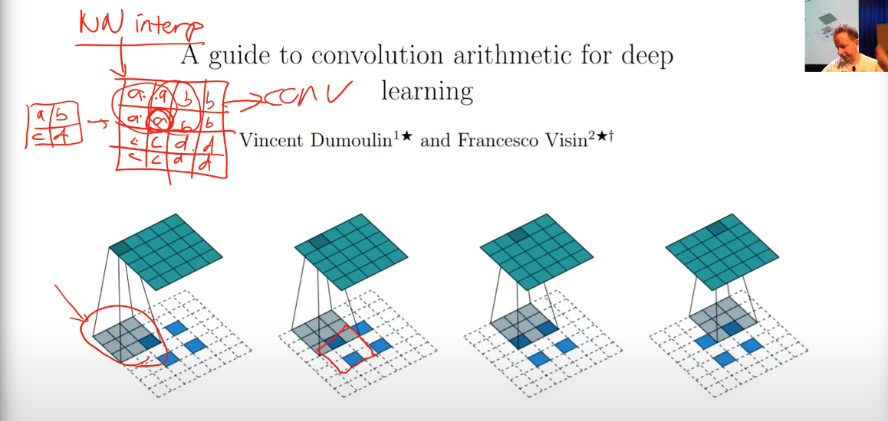
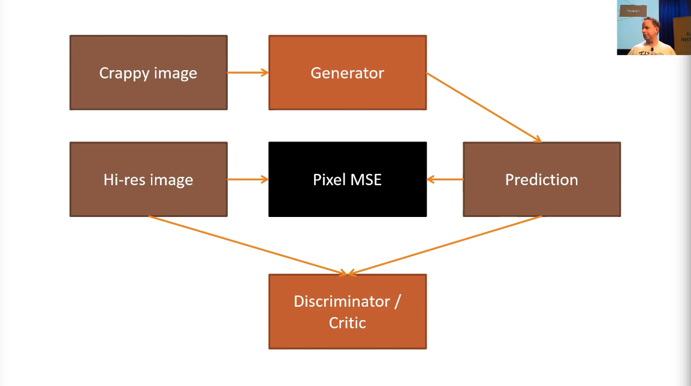

# Lesson 7: Resnets from scratch; U-net; Generative adversarial networks

Notebook: `lesson7-resnet-mnist`

PyTorch puts channel at the 1st dimension by default. An image in MNIST is a (1,28, 28) rank 3 tensor.

In fastai, there is a difference between validation and test set. Test set doesn't have label. Use validation set for model development. If you want to do inference on many things at a time and not one at a time, set the data as `test` instead of `valid`.

Initial steps:

1. Create ItemList from image folders
2. Split into `train` and `valid`.

Tip: for data augmentation, MNIST can't have much transformation, you can't flip it because it changes the meaning of the number, you can't zoom because it's low res. The only transform is to add random padding. *Do this transform on training set but not validation set.*

If not using a pretrained model, don't pass in `stat` in `normalize()` for databunch, it grabs a subset of the data at random and figures out how to normalize.

`plot_multi(_plot, nrow, ncol, figsize=())` is a fastai function that plots multiple examples in a grid. Define `_plot` first for what to show.

```py
# Showing a batch of data using the DataBlock API
xb,yb = data.one_batch()
xb.shape,yb.shape

# DataBunch has .show_batch()
data.show_batch(rows=3, figsize=(5,5))
```

Then we define the convolution function with fixed kernel size, stride and padding.

```py
# ni is # input channels, nf is # output filters (kernels)
def conv(ni,nf):
    return nn.Conv2d(ni, nf, kernel_size=3, stride=2, padding=1)

model = nn.Sequential(
    # 1 channel in, 8 channels out (picked by us), output size 8*14*14
    conv(1, 8),
    nn.BatchNorm2d(8),
    nn.ReLU(),
    # 8 channel in, 16 channels out (picked by us), output size 16*7*7
    conv(8, 16), # 7
    nn.BatchNorm2d(16),
    nn.ReLU(),
    # 16 channel in, 32 channels out (picked by us), output size 32*4*4
    conv(16, 32), # 4
    nn.BatchNorm2d(32),
    nn.ReLU(),
    # 32 channel in, 16 channels out (picked by us), output size 16*2*2
    conv(32, 16), # 2
    nn.BatchNorm2d(16),
    nn.ReLU(),
    # 16 channel in, 10 channels out (picked by us), output size 10*1*1
    conv(16, 10), # 1
    nn.BatchNorm2d(10),
    Flatten()     # remove (1,1) grid
)
```

Trick: `Flatten()` gets rid of all the unit axes (the axes with 1s)! `(10, 1, 1)` becomes just `(10,)`, a flat vector of dim 10!

```py
# create learner
learn = Learner(data, model, loss_func = nn.CrossEntropyLoss(), metrics=accuracy)
# print learner summary
print(learn.summary())
# pop data onto GPU
xb = xb.cuda()
# check model output shape
model(xb).shape
```

This is a model we built from scratch with a simple CNN architecture, it takes 12s to train on my GPU and got 98.8% accuracy! Already super good.

## Refactor

fastai has `conv_layer` so we can skip writing all the batch norm and relu's.

```py
def conv2(ni,nf): return conv_layer(ni,nf,stride=2)

model = nn.Sequential(
    conv2(1, 8),   # 14
    conv2(8, 16),  # 7
    conv2(16, 32), # 4
    conv2(32, 16), # 2
    conv2(16, 10), # 1
    Flatten()      # remove (1,1) grid
)

learn = Learner(data, model, loss_func = nn.CrossEntropyLoss(), metrics=accuracy)

learn.fit_one_cycle(10, max_lr=0.1)
```

It's the same as previous code, just looks better. Train 10 epochs, we can get to 99%+ accuracy.

## Introduce the Residual Block

The residual block is a revolutionary technique in computer vision.

Kaiming He et. al. at Microsoft Research initially found that a 56-layer CNN was performing worse than a 20-layer CNN which made no sense. He created an architecture where a 56-layer CNN *contains* the 20-layer CNN, by adding some skip connections that skipped some conv layers. That way, it must be as least as good as the 20-layer CNN because the deeper CNN could just set the skipped conv layers to 0 and only keep the identity links.



Instead of having

```
output = conv( conv (x) )
```

The residual block is

```
output = conv( conv (x) ) + x
```

The result was that he won ImageNet that year (2015).

Trick: if an NN or GAN doesn't work so well, try replacing the conv layers with residual blocks!

Check out the fantastic paper [Visualizing the Loss Landscape](https://arxiv.org/abs/1712.09913). This is 3 years later since ResNet, and people started to realize why it worked. With the skip connections, the loss landscape is much smoother.

The batch norm had the same story. This reminds us *innovation usually comes from intuition*. Intuition comes first, people realize what's going on and why it works much later.



fastai has `res_block`. We add a `res_block` after every `conv2` layer from previous code, we get

```py
model = nn.Sequential(
    conv2(1, 8),
    res_block(8),
    conv2(8, 16),
    res_block(16),
    conv2(16, 32),
    res_block(32),
    conv2(32, 16),
    res_block(16),
    conv2(16, 10),
    Flatten()
)
```

Further refactoring it,

```py
def conv_and_res(ni,nf):
    return nn.Sequential(conv2(ni, nf), res_block(nf))

model = nn.Sequential(
    conv_and_res(1, 8),
    conv_and_res(8, 16),
    conv_and_res(16, 32),
    conv_and_res(32, 16),
    conv2(16, 10),
    Flatten()
)

learn = Learner(data, model, loss_func = nn.CrossEntropyLoss(), metrics=accuracy)

learn.lr_find(end_lr=100)
learn.recorder.plot()

learn.fit_one_cycle(12, max_lr=0.05)

print(learn.summary())
```

Tip: when you try out new architectures, keep refactor the code and reuse more to **avoid mistakes**.

Resnet is quite good and can reach SOTA accuracy for a lot of tasks. More modern techniques such as group convolutions don't train as fast.

*DenseNet* is another architecture, its only difference from Resnet is that instead of a `x + conv(conv(x))`, it does `concat(x, conv(conv(x)))` (the channel gets a little bigger). It is called a *DenseBlock* instead of ResBlock. The paper of DenseNet seems complicated but it's really very similar to Resnet.

DenseNet is very memory intensive because it maintains all previous features, BUT it has much fewer parameters. **It works really well for small datasets**.

## U-Net

Use resnet34 and half-stride. What half-stride is really doing is *nearest-neighbor interpolation* or a *bilinear interpolation* with stride 1, it up samples the patch and increases the size, as shown below.



Fantastic paper for convolution: [A Guide to Convolution Arithmetic for Deep Learning](https://arxiv.org/pdf/1603.07285.pdf)

Nowadays we use a pretrained resnet34 as the *encoder* in U-net.

Trick: if you see two convs in a row, probably should use a resnet block instead. A skip connection with "+" or "concat" usually works great.

U-net came before resnet and densenet but it had a lot of the similar ideas and worked great for segmentation tasks.

## Image Restoration with U-Net and GAN

Notebook: superres-gan

We use the U-net architecture to train a super-resolution model. This is a model which can increase the resolution of a low-quality image. Our model won't only increase resolution—it will also remove jpeg artifacts, and remove unwanted text watermarks.

In order to make our model produce high quality results, we need to create a custom loss function which incorporates *feature loss (also known as perceptual loss)*, along with *gram loss*. These techniques can be used for many other types of image generation task, such as image colorization.

Traditionally, the GAN is hard to train because the initial generator and critic are bad. Fastai uses pretrained generator and critic, so they are already pretty good. After that the training of GAN is much easier.



To train a fastai version GAN, we need two folders, one with high-res original images, one with generated images.


